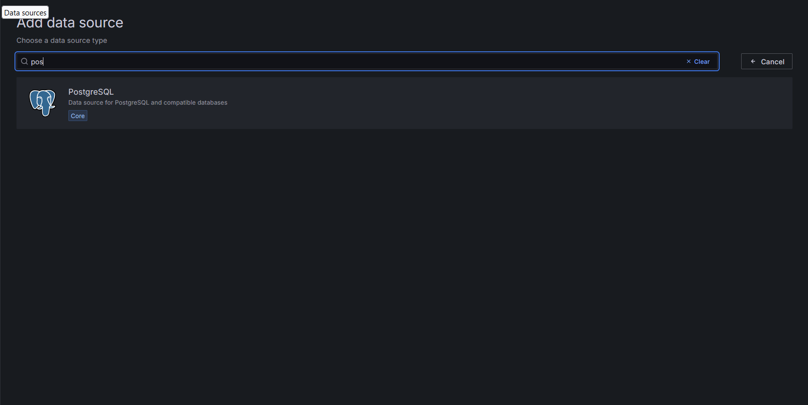
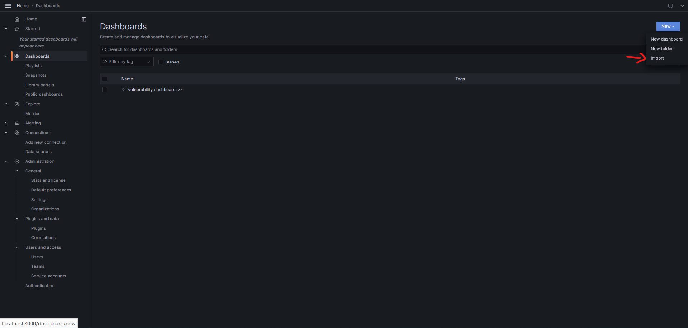
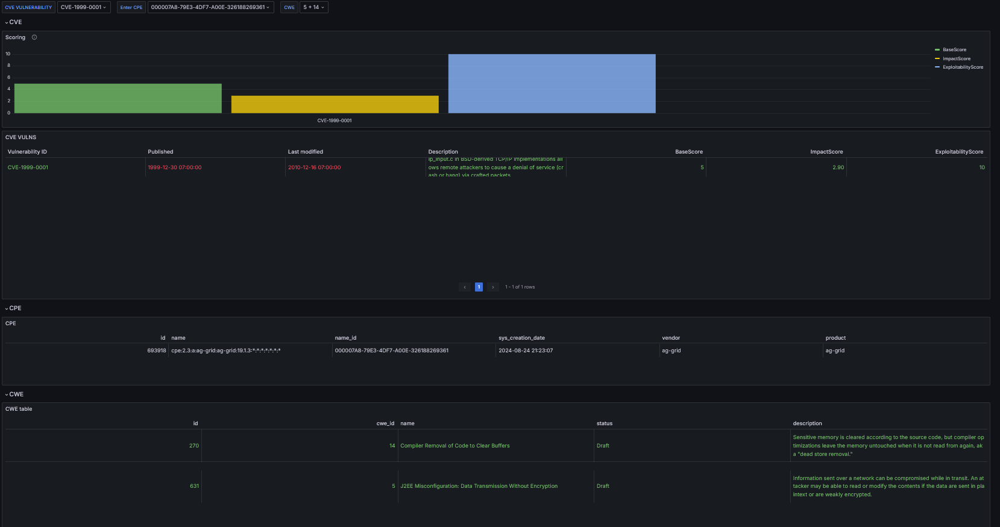

# FastCVE Grafana Dashboard

## Project Overview

This project provides a Grafana dashboard for visualizing CVE (Common Vulnerabilities and Exposures) data. The dashboard supports searching, displaying, and visualizing data based on CVE, CWE, and CPE standards.

## Features

- **Comprehensive Data Visualization**: Display and analyze CVE data.
- **Standards Integration**: Seamless integration with CVE, CWE, and CPE data.
- **Interactive Filters**: Customize the data displayed with user-friendly filters.

## Setup Instructions

### Prerequisites

- Docker
- Docker Compose

## Automating the Setup with setup.sh

To simplify the setup process, you can use the setup.sh script provided in this repository. This script automates the following tasks:

    1. Cloning the FastCVE repository.
    2. Navigating into the FastCVE directory.
    3. Building the Docker images.
    4. Starting the Docker containers.

## How to Use setup.sh

    Make the Script Executable:

    Before running the script, you need to give it executable permissions. Run the following command in your terminal:

#### 1. A

```bash
chmod +x setup.sh
./setup.sh
```

```

### 3. Add the new DataSource

Connect postgress database to Grafana.



### 3. Import the Grafana Dashboard

Open your web browser and navigate to http://localhost:3000.
Log in to Grafana using the default credentials (username: admin, password: admin).
Go to Dashboards -> Manage.
Click the Import button.
Upload the dashboard.json file located in the FastCVEDashboard repository.



### 4. Access the Dashboard

After importing the dashboard, you can access it directly through Grafana's interface and start exploring the vulnerability data.


```
