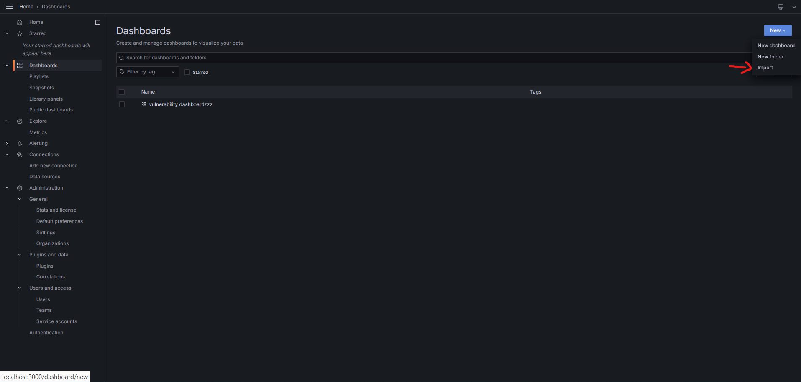

# FastCVE Grafana Dashboard

## Project Overview

This project provides a Grafana dashboard for visualizing CVE (Common Vulnerabilities and Exposures) data. The dashboard supports searching, displaying, and visualizing data based on CVE, CWE, and CPE standards.

## Features

- **Comprehensive Data Visualization**: Display and analyze CVE data.
- **Standards Integration**: Seamless integration with CVE, CWE, and CPE data.
- **Interactive Filters**: Customize the data displayed with user-friendly filters.

## Setup Instructions

### Prerequisites

- Docker
- Docker Compose

### Steps to Run the Project

#### 1. Clone the FastCVE project and configure the project with the instructions in README.md file.

```bash
git clone https://github.com/binareio/FastCVE.git
```

### 2. Run Grafana

Ensure that both FastCVE and Grafana containers are running in the same Docker network, so it's easier to configure the grafana dashboard to fastcve backend.

```bash
docker run -d --name=grafana -p 3000:3000 grafana/grafana
```

### 3. Import the Grafana Dashboard

Open your web browser and navigate to http://localhost:3000.
Log in to Grafana using the default credentials (username: admin, password: admin).
Go to Dashboards -> Manage.
Click the Import button.
Upload the dashboard.json file located in the FastCVEDashboard repository.



### 4. Access the Dashboard

After importing the dashboard, you can access it directly through Grafana's interface and start exploring the CVE data.
